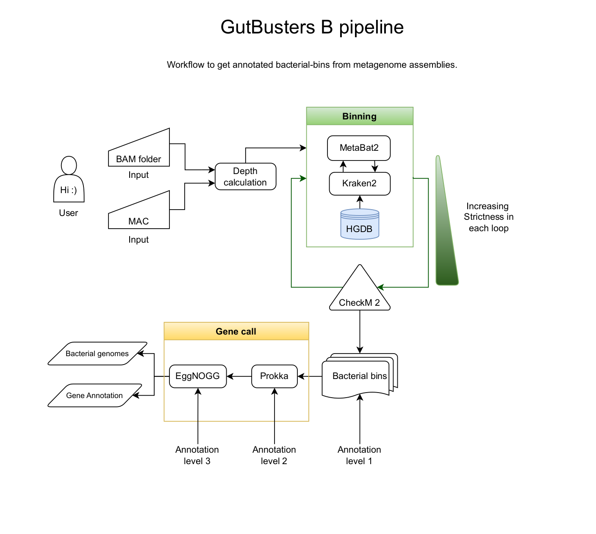
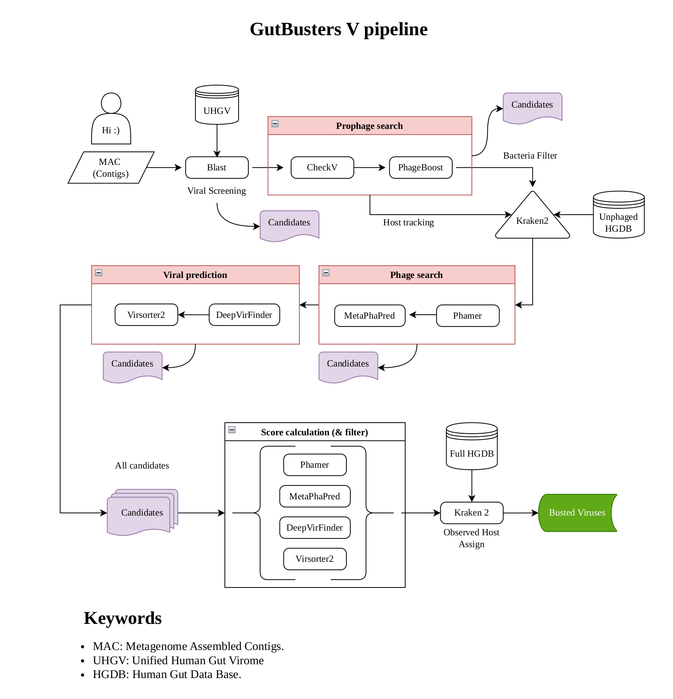

Pipeline for mining phages/viruses and bacteria from the Human Gut.

# Installation
We understand the complexity of having a pipeline and what it means for the installation. That's why we work with containers. the installation as simple as download a big file using `wget` (or your favorite command).
### Gutbusters bacteria
```wget -O gutbustersB_v1.sif https://datacloud.helsinki.fi/index.php/s/4SX7wmZBttpnWRg/download```

### Gutbusters viruses (pro/phages, viruses)
```wget -O gutbustersV_v1.sif https://datacloud.helsinki.fi/index.php/s/yAYN7HEHnSTk93n/download```

# Usage
In case of phages/viruses, the input is only the metagenome assembly.

### Gutbusters viruses
```
apptainer run gutbusters_v1.sif \
--in my_contigs.fna \
--outdir my_outdir \
--threads 8
```

* --in: Path to the input contig FASTA file (.fna/.fa/.fasta) containing assembled contigs to analyze.

* --outdir: Output directory where all generated results, annotations, summaries, and intermediate files will be written.

* --threads: Number of CPU threads to use during processing. Higher values increase parallelization and reduce runtime.


### Gutbusters bacteria

In case of bacteria, the input is is the metagenome assembly + the bams associated to it (reads mapped back to the assembly. 1 or more).

```
apptainer run gutbustersB_v1.sif \
  --in test_data/contigs.fna \
  --bam my_bam_folder \
  --outdir my_output_folder_name \
  --threads 8 \
  --min-len 2000 \
  --annot-level 1
```

* --in: Path to the input contig FASTA file (.fna/.fa/.fasta) containing assembled contigs to analyze.

* --bam: Directory containing BAM alignment files used for coverage/depth calculations. BAM files should be indexed (.bai) and correspond to reads mapped against the input contigs.

* --outdir: Output directory where all generated results, annotations, summaries, and intermediate files will be written.

* --threads: Number of CPU threads to use during processing. Higher values increase parallelization and reduce runtime.

* --min-len: Minimum Bins length when recovering genomes (in base pairs). Bins shorter than this threshold will be excluded.

* --annot-level: Annotation sensitivity/stringency level. Lower values prioritize broader and faster annotation, while higher levels may apply stricter or more detailed annotation procedures (Eggnog).

# How it works
### For Bacteria


### For Viruses

